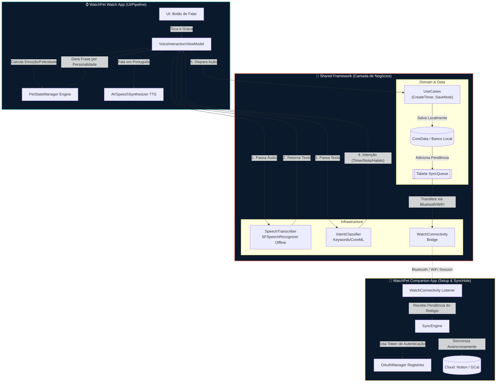

# 🐾 WatchPet

**Seu Companheiro Inteligente no Pulso**

O **WatchPet** é um aplicativo focado em produtividade, bem-estar e gestão contínua, construído em torno da ideia de ter um "Pet" digital inteligente morando diretamente no seu Apple Watch. 

Ele atua como um companheiro dinâmico (com diversas personalidades) que responde à sua voz, ajuda a criar lembretes, gerenciar timers (foco, hidratação), tirar notas instantâneas e acompanhar seus hábitos diários. A grande premissa do aplicativo é realizar tudo isso de forma **fluida**, **offline-first** e **conversacional**, assegurando respostas hiper-rápidas e respeitando fortemente a sua proteção e privacidade de dados.

---

## 🎯 Visão e Funcionalidades

- **Comunicação Ativa e Instantânea (Voice-First):** Interações ágeis usando reconhecimento de fala no próprio dispositivo para responder a solicitações de produtividade sem precisar da internet.
- **Motor de Personalidade Emocional (O Pet):** O Pet não é estático; ele ganha vida ao reagir às suas palavras, variando as emoções baseado na constância dos seus hábitos. O motor de personalidade varia de cães "Entusiastas" a "Sarcásticos" ou gatos "Minimalistas". 
- **Ausência de Fricção Cognitiva:** Esqueça abrir dezenas de apps no pulso. Com apenas um botão, extraia a intenção, defina a tarefa ou crie uma anotação com simples sentenças ditadas como: "*Lembre-se da reunião de sábado*".
- **Sincronização Invisível:** Com a ajuda do app do iPhone atuando como um hub, as notas e dados que você cria perfeitamente no Watch em 3 segundos são enfileiradas silenciosamente e lançadas a serviços de integração de nuvem (como Notion e Google Calendar) à primeira oportunidade em rede.

---

## 🏗 Arquitetura e Infraestrutura

A engenharia do ecossistema do WatchPet tem como base uma fundação **Clean Architecture** baseada e guiada por **Domain-Driven Design (DDD)**. Foi projetada assim para que regras sistêmicas de terceiros (como a SDK da Apple para fala) ou de APIs (Notion) nunca encostem ou viciem a base emocional e processual do código. 

### Principais Atores:
1. **Apple Watch App (`WatchPet_Watch`):** Onde o app acontece. O coração da escuta é o `VoiceInteractionViewModel`. Ele captura a voz em texto as passa por um algoritmo `IntentClassifier` para interpretar ordens de ação e, via CoreData offline, as salva. Paralelamente, o `PetStateManager` escolhe a representação emocional desse acionamento.
2. **Companion iOS App (`WatchPet_iOS`):** Funciona como a "Sala de Controle". Gerencia os setups de OAuth, perfis da conta local e, sob sua guarda, vive o massivo `SyncEngine`, motor que recebe as pendências via Apple WatchConnectivity e escoa para serviços digitais online.
3. **Shared Framework (`Shared`):** Uma única ponte onde ambas as plataformas sugam as veias dos `UseCases`, `Entities` puras do domínio e implementações subjacentes (`CoreData`, `SpeechRecognition`).

<details>
<summary><b>Visualizar o Diagrama Mermaid</b></summary>



</details>

---

## 📂 Visão Ampla de Organização

```
WatchPet/
├── WatchPet_iOS/          # Companion app iPhone
│   └── Sources/
│       ├── App/           # Entry point
│       ├── Features/      # Onboarding, Configurações Múltiplas
│       └── Core/          # Injeção de Dependências
│
├── WatchPet_Watch/        # Apple Watch app principal
│   └── Sources/
│       ├── App/           # Entry point e Views Isoladas
│       ├── Features/      # Timers, Lembretes, Pet Core e View de Voz
│       └── Core/          # Injeção de Dependências (Watch)
│
└── Shared/                # Framework Core (A cola de tudo)
    └── Sources/
        ├── Domain/        # Entities Universais, Casos de Uso e Interfaces
        ├── Data/          # Implementações do CoreData e Protocolos de Repositórios
        ├── Infrastructure/# Tradutores de Speech, LLM Local, WatchConnectivity
        └── Integration/   # Autenticação (OAuthManager) e Transições para Nuvem
```

## ⚙️ Requisitos

- Xcode 15.2+
- watchOS 10.0+ (Apple Watch Series 9 / Ultra 2 / SE 2ª gen em diante)
- iOS 17.0+
- Swift 5.9+ e Concorrência Ativada
