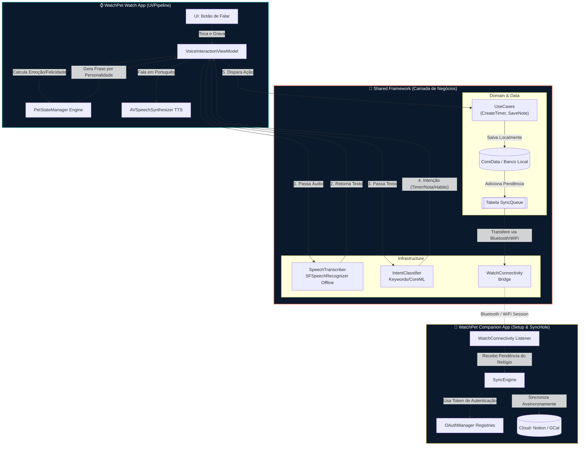

```mermaid
graph TD
    classDef watchApp fill:#0b192c,stroke:#2a9d8f,color:#fff,stroke-width:2px;
    classDef iosApp fill:#0b192c,stroke:#e9c46a,color:#fff,stroke-width:2px;
    classDef shared fill:#0b192c,stroke:#e76f51,color:#fff,stroke-width:2px;
    
    subgraph AppleWatch["⌚️ WatchPet Watch App (UI/Pipeline)"]
        View["UI: Botão de Falar"]
        VIVM["VoiceInteractionViewModel"]
        Pet["PetStateManager Engine"]
        TTS["AVSpeechSynthesizer TTS"]
        
        View -- "Toca e Grava" --> VIVM
        VIVM -- "Calcula Emoção/Felicidade" --> Pet
        Pet -- "Gera Frase por Personalidade" --> VIVM
        VIVM -- "Fala em Português" --> TTS
    end

    subgraph Shared["🧩 Shared Framework (Camada de Negócios)"]
        subgraph Infra["Infrastructure"]
            ST["SpeechTranscriber<br/>SFSpeechRecognizer Offline"]
            IC["IntentClassifier<br/>Keywords/CoreML"]
            WCB["WatchConnectivity<br/>Bridge"]
        end
        
        subgraph DomainAndData["Domain & Data"]
            UC["UseCases<br/>(CreateTimer, SaveNote)"]
            CD[("CoreData / Banco Local")]
            SyncQueue[["Tabela SyncQueue"]]
        end
        
        VIVM -- "1. Passa Áudio" --> ST
        ST -- "2. Retorna Texto" --> VIVM
        VIVM -- "3. Passa Texto" --> IC
        IC -- "4. Intenção (Timer/Nota/Habito)" --> VIVM
        VIVM -- "5. Dispara Ação" --> UC
        UC -- "Salva Localmente" --> CD
        CD -- "Adiciona Pendência" --> SyncQueue
        SyncQueue -- "Transfere via Bluetooth/WiFi" ---> WCB
    end

    subgraph iPhoneApp["📱 WatchPet Companion App (Setup & SyncHole)"]
        WCB_iOS["WatchConnectivity Listener"]
        iOSSyncEng["SyncEngine"]
        OAuth["OAuthManager Registries"]
        External[("Cloud: Notion / GCal")]
        
        WCB_iOS -- "Recebe Pendência do Relógio" --> iOSSyncEng
        iOSSyncEng -- "Usa Token de Autenticação" --> OAuth
        iOSSyncEng -- "Sincroniza Assincronamente" --> External
    end

    WCB -. Bluetooth / WiFi Session .- WCB_iOS

    class AppleWatch watchApp;
    class iPhoneApp iosApp;
    class Shared shared;
```